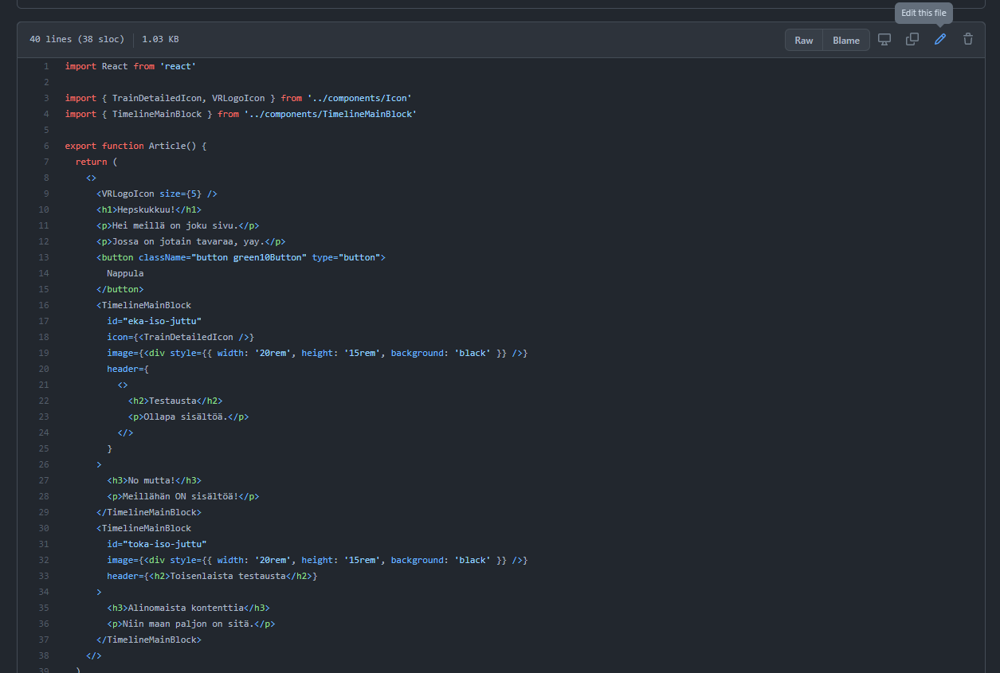
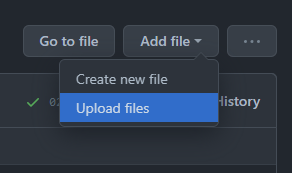

## Tervetuloa GitHubiin!

Ennen kuin aloitat, niin oletan että olet tehnyt GitHub-tunnuksen (kaksivaiheisella tunnistautumisella) ja että sinut on lisätty projektiin mukaan.

Tämä projekti pohjautuu Astroon. Projekti rakentuu staattisista ja dynaamisista palasista. Staattinen puoli on `public`-hakemisto, joka kopioidaan palvelimelle sellaisenaan. Se on hyvä paikka kuville!

Varsinaiset dynaamisesti luodut sivut sijaitsevat `src/pages`. Täällä sijaitseva `index.astro` on juurisivu. Myös `pages`-hakemiston rakenne kopioituu palvelimelle, mutta Astro-tiedostot muutetaan HTML-dokumenteiksi.

Täten jos meillä olisi kuvitteellinen tiedosto `src/pages/moikkelis-koikkelis/index.astro` niin tästä johdetaan osoite `https://jonkin.domainin-nimi.fi/moikkelis-koikkelis`.

### Sisällön tuottaminen

Varsinainen sisältösivu on (kirjoitushetkellä) sijoitettu tiedostoon `src/pages/index.tsx`.

Selaamalla siihen GitHubin tiedostolistauksen kautta löytää tämännäköisen sivun:



GitHub tarjoaa suoraan muokkausmahdollisuuden oikeasta ylälaidasta löytyvän nappulan kautta.

Avautuva koodi muistuttaa hyvin paljon HTML:ää, mutta vaatii enemmän tiukkuutta eli virheet rikkovat sivun.

### Aikajana

Aikajanan komponentti mahdollistaa pääosan, kuvan, ja sisällön lisäämisen.

```tsx
<TimelineMainBlock
  id="eka-iso-juttu"
  image={}
  header={
    <>
      <h2>Otsikko</h2>
      <p>Tämä on aikajanan pääosa</p>
    </>
  }
>
  <h3>Piilotettu sisältö</h3>
  <p>Täällä oleva osuus tulee esille kun aikajana avataan</p>
</TimelineMainBlock>
```

Näitä voi sijoittaa useamman peräkkäin jolloin varsinainen aikajana rakentuu.

TimelineMainBlock tukee useita attribuutteja:

`<TimelineBlock id="" image={} header={<>...</>}>`

- `id` tulee sisältää uniikki teksti. Kunhan on erilainen kuin muut ID:t ja alkaa kirjaimella, niin hyvä.
- `image` sisältää aikajanan kuvaosan. Tähän on mahdollista laittaa muutakin kuin kuva.
- `header` sisältää aikajanan pääosan, joka näkyy kuvan ohessa.

Tämän TimelineBlockin "sisälle" voi sitten sijoittaa lisää sisältöä, joka tulee nähtäville kun lohkon avaa.

Jos sisällössä tarvitsee ilmaista pienempi kuin tai suurempi kuin, niin ne voi ilmaista käyttäen `&lt;` (<) sekä `gt;` (>).

`</TimelineMainBlock>` päättää lohkon.

### Kuvat

Kuvat voi sijoittaa esimerkiksi `public/images`-hakemistoon. Tällöin koodiin kirjoitettu `` viittaa samaiseen kuvaan `images`-hakemistossa.

Voit lisätä kuvan ennen tai jälkeen sivun muokkaamisen. Kuvan lisäämiseksi sivun muokkauksen aikana voit avata esimerkiksi selaimeen uuden välilehden ja selata GitHubissa haluttuun hakemistoon, jonne kuva lisätään ja sitten käyttää GitHubin tiedostojen lähettämistoimintoa:



Selkeyden vuoksi on suotavaa käyttää kuvan tiedostonimessä ainoastaan pieniä kirjaimia sekä välttää välilyönnin käyttöä.
